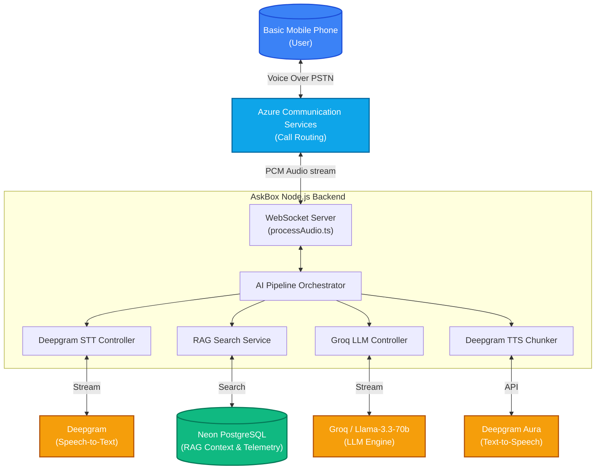
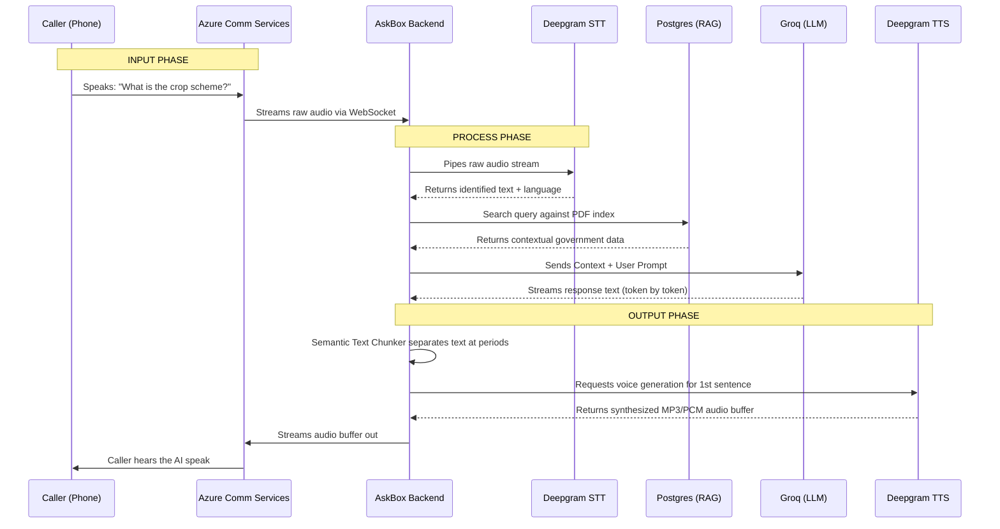

# AskBox: AI for Social Good - System Architecture & Flow

This document outlines the system architecture, data flow, and features of the AskBox Voice Intelligence platform—designed to bring the world's knowledge to rural India via basic phone calls.

---

## 🌟 Key Features
1. **Zero Internet Requirement:** Users dial a toll-free number from any basic feature phone.
2. **Native Language Processing:** Understands and speaks in local dialects (Hindi, Marathi, Tamil, Bengali, etc.).
3. **Sub-second Real-Time Latency:** Uses semantic audio chunking and streaming LLMs to respond organically without awkward pauses.
4. **Barge-in / Interruption Handling:** If the user speaks while the AI is talking, the AI instantly stops, listens, and adjusts dynamically.
5. **RAG Knowledge Base:** Admins can upload PDFs and documents (e.g., government schemes, agricultural data) to augment the AI's intelligence.
6. **Global Telemetry Dashboard:** Real-time visualization of regional call volume, compute load, STT accuracy, and dialect clusters.

---

## 🤖 AI Services Utilized
* **Speech-to-Text (STT):** **Deepgram** (WebSocket API for ultra-fast, real-time transcription and language detection).
* **Large Language Model (LLM):** **Groq Cloud (Llama 3.3 70B Versatile)** (Using Groq's high-speed LPU infrastructure for instant reasoning and streaming text generation).
* **Text-to-Speech (TTS):** **Deepgram Aura** (REST API for human-like, natural voice synthesis in native accents).
* **RAG / Database Search:** **Neon Serverless PostgreSQL** (Utilizing built-in `tsvector` full-text search for fast document retrieval).

---

## 🏗️ System Architecture Diagram

---

## 🔄 Step-by-Step User Flow & Data Flow Diagram (Input -> Process -> Output)

### The User Interaction Flow
1. **Input (Call Initialization):** A farmer calls the toll-free number from a basic feature phone.
2. **Input (Speaking):** "पीक विमा योजनेसाठी कसा अर्ज करावा?" (How to apply for Crop Insurance?)
3. **Process (Ingestion):** Azure Communication Services passes the raw audio bit-stream over a WebSocket to our Node.js Backend.
4. **Process (Transcription):** The audio streams to Deepgram STT, which flags silence (endpointing) and confirms the translated text.
5. **Process (RAG Retrieval):** The backend searches Neon PostgreSQL for official agricultural scheme documents uploaded by admins.
6. **Process (Reasoning):** The text + the PDF context is streamed to Groq Cloud (Llama 3.3).
7. **Process (Synthesis):** Groq begins streaming text out immediately. Our semantic chunker cuts the text at the nearest comma/period and sends it to Deepgram TTS to generate the voice rapidly.
8. **Output (Playback):** The synthesized MP3/PCM audio buffers are streamed seamlessly back to Azure Communication Services over the WebSocket.
9. **Final Output:** The farmer hears a human-like voice response in fluent Marathi.

### Data Flow Diagram (DFD)

